# Multi-Agent Tournament Workflow — Visual Assets

## Option 1: Claude Design Prompt

Copy and paste this into Claude Design (claude.ai with artifact creation):

---

**Prompt:**

Create a polished infographic-style diagram explaining an autonomous multi-agent AI code review workflow called "Tournament Reviews." This is for a non-technical audience who wants to understand why multiple AI agents working together produce better results than a single AI response.

The visual should flow top-to-bottom with these 4 sections:

**Section 1 — "The Goal Gate" (top)**
Show a control panel or gate icon with 3 checkboxes:
- ✅ Feature build complete (lint, tests, build all green)
- ✅ Minimum bake time elapsed (5+ hours)
- ⬜ Two consecutive clean security reviews
The gate stays closed (session keeps running) until all 3 are checked. Label: "The /goal function — the AI doesn't decide when it's done. The exit conditions do."

**Section 2 — "The Tournament Loop" (middle, largest section)**
Show a circular/cyclical flow with these steps:
1. 🔍 "Fresh Reviewer Agent" — a new AI agent with no memory of previous work reads all 13 core files
2. 📋 "Findings Report" — agent outputs HIGH/MEDIUM issues with file:line references
3. 🔧 "Fix Cycle" — actionable findings get fixed in code, non-actionable ones get documented as "Known Deferrals" (shown as a side branch/shelf)
4. 🔄 Arrow back to step 1 with label "Repeat until 2 consecutive clean reviews"

Inside the loop, show a small counter: "Review #1: 9 findings → #5: 6 → #8: 12 → #12: 7 → #15: 1 → #22-23: 0, 0 ✅"

**Section 3 — "Why It Works" (bottom-left, 2x2 grid of cards)**
Four cards with icons:
- 👁️ "Fresh Eyes" — Each reviewer starts blank. No bias from writing the code.
- ⚔️ "Adversarial Pressure" — Reviewer's only job is finding problems, not defending decisions.
- 📈 "Compounding Quality" — Each round exposes issues hidden behind previously-fixed ones.
- 📝 "Institutional Memory" — Known deferrals list prevents circular re-discovery.

**Section 4 — "The Analogy" (bottom-right)**
Split panel comparison:
- Left: "Single Agent" — One house inspector, one visit, one report. Misses the electrical issue behind the drywall.
- Right: "Tournament Agents" — 23 inspectors visit one at a time. Each gets the previous inspectors' notes. By inspector #23, nothing is left to find.

**Style:** Clean, modern, dark background (slate-900), accent colors: emerald for success/checks, amber for findings, blue for agents, gray for deferred items. Use rounded cards with subtle shadows. Sans-serif font. No clip art — use simple geometric icons or emoji.

**Bottom bar:** "Session: 7 hours | 79 commits | 744 tests | 44 security findings fixed | 20 known deferrals documented"

---

## Option 2: Mermaid Diagram (use anywhere that renders Mermaid)

```mermaid
%%{init: {'theme': 'dark', 'themeVariables': { 'primaryColor': '#10b981', 'primaryTextColor': '#f8fafc', 'primaryBorderColor': '#34d399', 'lineColor': '#64748b', 'secondaryColor': '#f59e0b', 'tertiaryColor': '#3b82f6'}}}%%

flowchart TD
    subgraph GOAL["🎯 /goal — Exit Conditions"]
        direction LR
        A["✅ Phase A Complete<br/>Feature built, lint/test/build green"]
        B["✅ 5+ Hours Elapsed<br/>Minimum bake time"]
        C["⬜→✅ Two Consecutive<br/>Clean Reviews"]
    end

    GOAL -->|"All 3 met? → Stop<br/>Any unmet? → Keep going"| LOOP

    subgraph LOOP["🔄 Tournament Review Loop"]
        direction TB
        R1["🔍 Spawn Fresh Review Agent<br/><i>No memory of previous work</i><br/><i>Reads all 13 core files</i>"]
        R2{"📋 Findings?"}
        R3["🔧 Fix Cycle<br/>Edit code for actionable items"]
        R4["📝 Defer + Document<br/>Known tradeoffs with rationale"]
        R5["✅ Clean Review<br/>Add to consecutive count"]

        R1 --> R2
        R2 -->|"HIGH/MEDIUM found"| R3
        R2 -->|"CLEAN"| R5
        R3 --> R4
        R4 -->|"Re-review with<br/>updated exclusion list"| R1
        R5 -->|"< 2 consecutive"| R1
    end

    R5 -->|"2 consecutive clean ✅"| DONE

    subgraph DONE["🏁 Session Complete"]
        D1["44 findings fixed"]
        D2["744 tests passing"]
        D3["20 deferrals documented"]
        D4["79 commits pushed"]
    end

    subgraph WHY["💡 Why Multiple Agents Beat One Response"]
        direction LR
        W1["👁️ Fresh Eyes<br/>No bias from<br/>writing the code"]
        W2["⚔️ Adversarial<br/>Only job is<br/>finding problems"]
        W3["📈 Compounding<br/>Each round exposes<br/>hidden issues"]
        W4["📝 Memory<br/>Exclusion list<br/>prevents reruns"]
    end

    style GOAL fill:#1e293b,stroke:#10b981,stroke-width:2px
    style LOOP fill:#1e293b,stroke:#3b82f6,stroke-width:2px
    style DONE fill:#1e293b,stroke:#10b981,stroke-width:2px
    style WHY fill:#1e293b,stroke:#f59e0b,stroke-width:2px
```



## Option 3: Simple Text Diagram (works in any doc)

```
┌─────────────────────────────────────────────────────────┐
│  /goal — THE AI DOESN'T DECIDE WHEN IT'S DONE           │
│                                                          │
│  ✅ Feature complete    ✅ 5+ hours    ✅ 2 clean reviews │
│         All three must be true to stop.                  │
└────────────────────────┬────────────────────────────────┘
                         │
                         ▼
         ┌───────────────────────────────┐
         │  🔍 FRESH REVIEW AGENT        │ ◄──────────────┐
         │  • No memory of prior work    │                │
         │  • Reads all 13 core files    │                │
         │  • Gets exclusion list of     │                │
         │    known/deferred items       │                │
         └──────────────┬────────────────┘                │
                        │                                 │
                        ▼                                 │
                  ┌───────────┐                           │
                  │ Findings? │                           │
                  └─────┬─────┘                           │
                   ╱         ╲                            │
                  ╱           ╲                           │
           YES  ╱             ╲  NO (CLEAN)              │
               ▼               ▼                          │
    ┌──────────────┐   ┌──────────────┐                   │
    │ 🔧 FIX CODE  │   │ ✅ Count it   │                   │
    │ + document   │   │              │                   │
    │ deferrals    │   │ 2 in a row?  │                   │
    └──────┬───────┘   └──────┬───────┘                   │
           │               ╱     ╲                        │
           │         NO  ╱       ╲  YES                   │
           └─────────────┘         ▼                      │
                            ┌──────────┐                  │
                            │ 🏁 DONE   │                  │
                            └──────────┘

    Review #1:  9 findings ──fix──▶
    Review #5:  6 findings ──fix──▶
    Review #8:  12 findings ─fix──▶  ← new test code exposed hidden issues!
    Review #12: 7 findings ──fix──▶
    Review #15: 1 finding ───fix──▶
    Review #20: CLEAN ✅
    Review #21: 5 findings ──fix──▶  ← clean streak broken, restart count
    Review #22: CLEAN ✅
    Review #23: CLEAN ✅ ◄── TWO CONSECUTIVE — EXIT

    ┌─────────────────────────────────────────────────────┐
    │  THE HOUSE INSPECTION ANALOGY                        │
    │                                                      │
    │  Single Agent    │  Tournament Agents                │
    │  ────────────    │  ─────────────────                │
    │  1 inspector     │  23 inspectors                    │
    │  1 visit         │  1 at a time                      │
    │  1 report        │  each gets prior notes            │
    │  misses the      │  by #23, nothing                  │
    │  electrical      │  left to find                     │
    │  behind the      │                                   │
    │  drywall         │                                   │
    └─────────────────────────────────────────────────────┘
```
